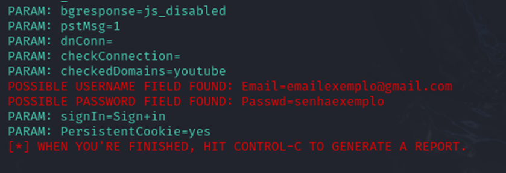

# Desafio-DIO Phinshing para captura de senhas Google

### Ferramentas
•	Kali Linux
•	setoolkit

### Cofigurando o Phishing no Kali Linux
•	Iniciando o setoolkit: sudo setoolkit
 *Obs: No comando acima sem acessar o root vai pedir a senha do Kali.*

•	Tipo de ataque: Social-Engineering Attacks
•	Vetor de ataque: Web Site Attack Vectors
•	Método de ataque: Credential Harvester Attack Method
•	Método de ataque: Web templates
•	Obtendo endereço da Máquina: ifconfig
•	Escolha do Template: Google

### Resultados 

